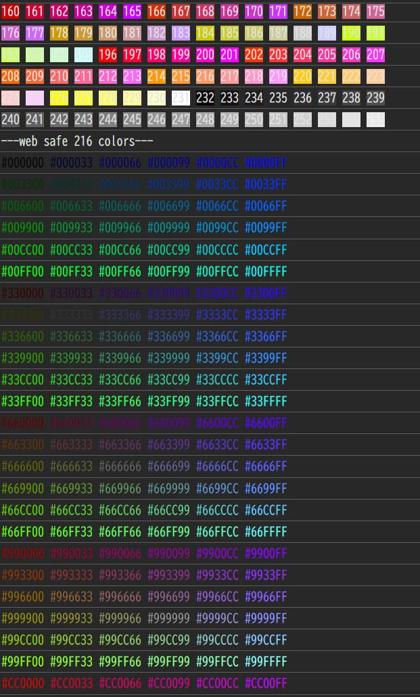
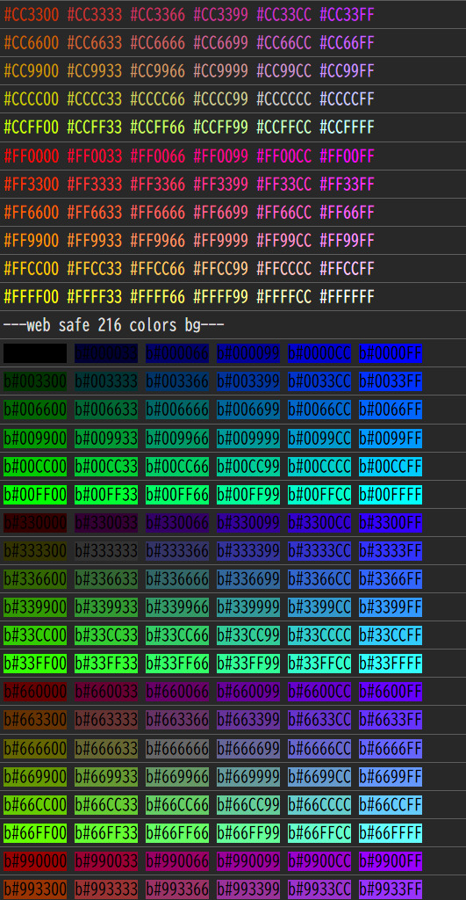
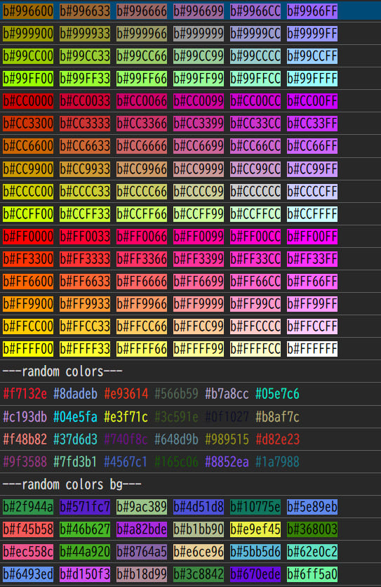

ansi-log-ts (WIP)
==================

This package is a work-in-progress extraction of the ANSI console helpers
from the "colors.tsz" codebase.

At the moment it simply re-exports the built "ansi-log-ts" module from
the root project:

- CJS: require("ansi-log-ts").logAnsi

- ESM: import { logAnsi, toConsoleArgsFromAnsi } from "ansi-log-ts";

